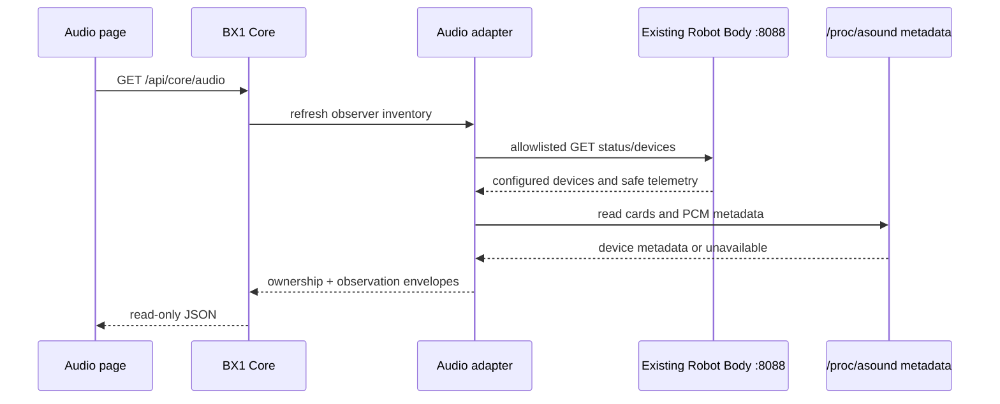

# BX1 OS Read-Only Audio Integration

## Scope

Alpha v0.4.0 adds an Audio page and audio telemetry without taking microphone
or speaker ownership. The existing Robot Body remains the speech owner.

BX1 OS prefers existing Robot Body status. It supplements that status with
ALSA metadata from `/proc/asound`; it checks whether ALSA tools exist but never
runs capture, playback or mixer commands. It does not change gain, volume,
mute, format, routing, wake-word, STT or TTS configuration.

## Ownership model

When the Robot Body is connected, its configured microphone and speaker are
shown as owned by `bx1-web.service`; control is blocked. If it exposes input
level telemetry, BX1 OS labels it `proxied_from_robot_body`. Otherwise it
reports `measurement_unavailable_while_owned` and does not attempt to open the
microphone.

Process ownership found through bounded `/proc/<pid>/fd` inspection is also
reported. Process environments are never read or returned.

## Device and telemetry fields

Microphones may report ALSA card/device, friendly name, configured/default
status, sample rate, channel count, format capability metadata, ownership,
availability and health. Speakers may report ALSA identity, configured/default
status, volume, mute state, ownership, availability and health.

The Core publishes:

- `hardware.audio.microphones`
- `hardware.audio.speakers`
- `audio.input.level_rms`
- `audio.input.level_peak`
- `audio.input.noise_floor`
- `audio.input.last_sample_timestamp`
- `audio.input.measurement_state`
- `audio.input.owner`
- `audio.output.owner`
- `audio.stt.state`
- `audio.tts.state`

Each state observation includes timestamp, source, quality, stale and error
fields.

## API and UI

- `GET /api/core/audio` returns device and telemetry state.
- `GET /api/core/audio/devices` returns microphone and speaker inventories.
- The browser refreshes both through the existing five-second Core polling
  cycle.

The Audio page contains Overview, Microphones, Speakers, Levels, DSP, Wake
Word, STT and TTS sections. v0.4.0 control affordances are disabled and labelled
`Future controlled operation`.

## Failure behaviour

Missing ALSA tools, absent `/dev` entries, denied metadata, busy devices,
Robot Body timeouts and malformed responses are safe degraded states. No
fallback opens a device. Optional audio absence is not a global BX1 OS fault.

## Known limitations

- Supported formats/rates/channels appear only when exposed by safe metadata
  or the existing API.
- Real-time levels are not generated by BX1 OS.
- Default-device metadata reflects existing configuration, not a new ALSA
  selection.
- DSP, wake-word, STT and TTS controls are future work.
