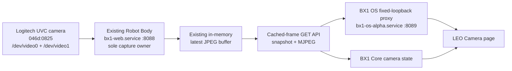
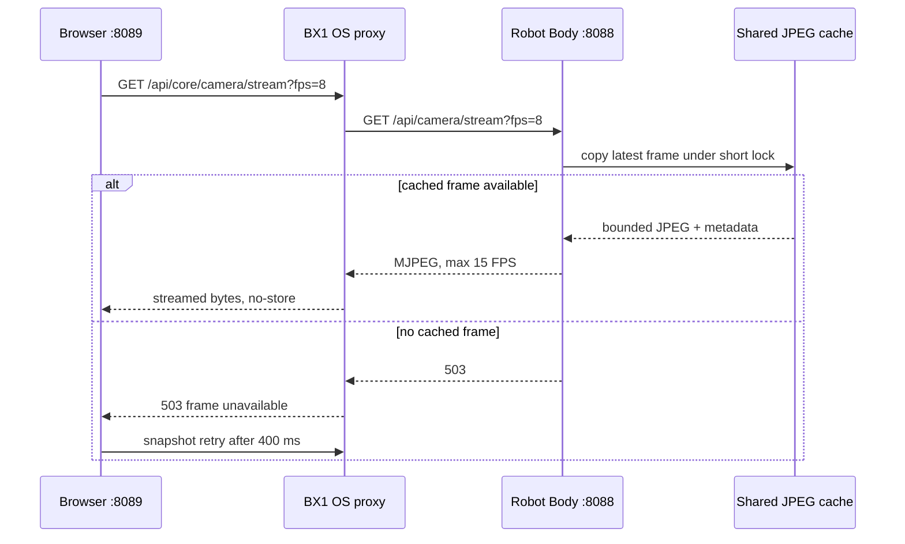

# BX1 OS Safe Camera Preview Integration

## Scope and safety boundary

BX1 OS Alpha v0.5.0 adds a near-live preview for LEO without becoming a camera
owner. Robot Body remains the only component permitted to capture from the
Logitech UVC camera (`046d:0825`). BX1 OS never imports OpenCV for preview,
creates `VideoCapture`, opens `/dev/video*`, changes V4L2 settings, or exposes a
camera write API.

Detection, observation and control remain distinct:

- detection reads device and sysfs metadata;
- observation receives a copy of Robot Body's latest bounded JPEG;
- control is blocked and is not present in the API.

## Ownership architecture



The new Robot Body endpoints reuse the existing `latest_camera_jpeg` buffer:

- `GET /api/camera/snapshot`
- `GET /api/camera/stream?fps=8`

They return `503` when no cached frame exists. They do not call
`get_camera_snapshot_jpeg()` or `CameraCapture.capture_jpeg()`, so a BX1 OS
request cannot trigger physical capture. The legacy Robot Body snapshot route is
unchanged and is not used by BX1 OS.

The BX1 OS deployment archive never writes to the live Robot Body installation.
On robots whose Body release predates these cached-frame endpoints, a separate
reviewed Robot Body update is a prerequisite. Until then, the proxy returns a
graceful unavailable response and the physical camera remains untouched.

## Snapshot and stream flow



The browser prefers MJPEG and falls back to no-store JPEG snapshots every 400
ms. It closes the stream when navigating away or hiding the page, resumes when
visible, and never maintains duplicate preview connections.

## Performance limits

| Limit | Policy |
|---|---|
| Default preview rate | 8 FPS |
| Maximum preview rate | 15 FPS |
| High-CPU rate | 5 FPS when Core CPU is at least 85% |
| Maximum frame size | 2 MiB by default; hard ceiling 8 MiB |
| Browser snapshot fallback | 400 ms |
| Queue depth | One newest frame; no queue accumulation |
| Upstream streams | One concurrent Robot Body MJPEG stream |
| Transport | Loopback HTTP GET only |

Robot Body repeats the newest cached frame at the requested bounded rate. It
does not allocate an unbounded queue. BX1 OS relays fixed-size chunks and stops
reading when the browser disconnects.

## Security restrictions

`RobotBodyCameraClient` accepts only HTTP loopback hosts on port 8088 and only
uses compiled-in snapshot and stream paths. User-supplied upstream URLs are
rejected. The proxy never reads process environments or camera nodes.

The BX1 OS endpoints are read-only:

- `GET /api/core/camera`
- `GET /api/core/camera/snapshot`
- `GET /api/core/camera/stream`

POST, PUT, PATCH and DELETE continue to return the management interface's
fail-closed response. Images include `Cache-Control: no-store` and ownership
headers.

## Core state schema

The hardware plugin publishes these observation envelopes:

```text
camera.connected
camera.owner
camera.source
camera.streaming
camera.preview_available
camera.resolution
camera.fps
camera.frame_age_ms
camera.last_frame_timestamp
camera.frame_sequence
camera.health
camera.error
```

Every value contains `value`, `timestamp`, `source`, `quality`, `stale`, and
`error`. Raw V4L2 inventory remains available through the hardware API.
Robot-level presentation groups `/dev/video0` and `/dev/video1` by USB identity.
Internal qcom-venus encoder/decoder nodes are retained only in Advanced
inventory.

## Failure behaviour

- No cached Body frame: snapshot and stream return `503`; the page shows
  Offline and continues bounded reconnect attempts.
- Body unavailable or timed out: BX1 OS returns `502` with a stable error code.
- Malformed or oversized JPEG: the snapshot is rejected.
- Stale frame: preview remains optional and displays a stale warning.
- Second concurrent MJPEG consumer: the proxy returns `503` rather than creating
  another upstream stream.
- Browser disconnect: both proxy and Body stream handlers release promptly.
- High CPU: the effective stream rate is reduced to 5 FPS and telemetry reports
  `degraded_cpu`.

An unavailable optional preview does not make BX1 OS globally unhealthy.

## Operator verification

After an approved v0.5.0 canary start, verify:

```bash
curl -fsS http://127.0.0.1:8089/api/core/camera | python -m json.tool
curl -fsSI http://127.0.0.1:8089/api/core/camera/snapshot
systemctl is-active bx1-web.service
ss -ltn | grep -E ':(8088|8089)\b'
```

Do not run `v4l2-ctl`, OpenCV capture, or another camera process for preview
verification. Do not manually stop or restart `bx1-web.service`.
