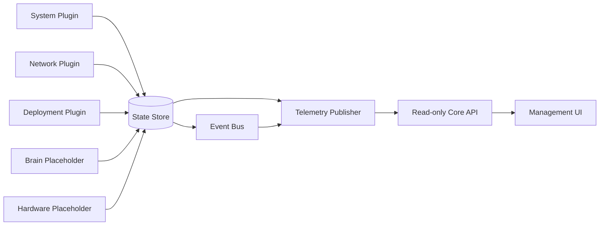
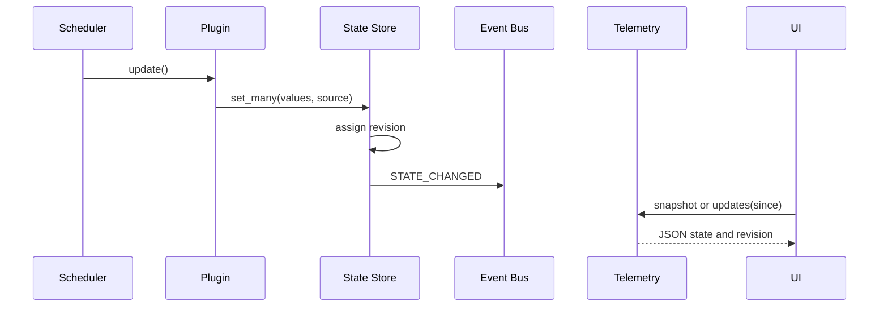

# BX1 OS Core

## Purpose

BX1 OS Core is the read-only state and telemetry authority introduced in Alpha
v0.3.0. Plugins observe their assigned subsystem, publish state into one
thread-safe database, and report health through one lifecycle contract. The
Management Interface consumes only Core API projections.

No browser route interrogates the host or hardware. Core does not provide
write, actuator, power, update or configuration operations in this release.

## Data flow

The cooperative plugin scheduler refreshes all plugins on a bounded interval
when the Core runtime is ticked by an API read. It creates no worker thread. A
state change receives a monotonically increasing revision and emits `STATE_CHANGED`.
The browser polls the read-only endpoints every five seconds and also provides
an explicit refresh action.
Consumers may request a full snapshot or changes after a known revision.
History exhaustion is explicit through `resync_required`.

## Runtime components

| Component | Responsibility |
|---|---|
| `state.py` | Thread-safe dotted-path state, revisions and bounded history |
| `events.py` | Synchronous publish/subscribe with isolated subscriber faults |
| `telemetry.py` | JSON snapshots, incremental updates and transport adapter hooks |
| `plugins/` | Discovery, lifecycle, host observers and placeholders |
| `registry.py` | Read-only service projection and plugin registry export |
| `core.py` | Composition root, update loop and API projections |
| `health.py` | Standard `healthy`, `warning`, `fault`, timestamp and details schema |

The existing BX1 digital-twin service graph remains intact. Core observes its
service registry through a provider and publishes the resulting view. The
Management Interface owns neither physical devices nor systemd.

## State namespaces

The database is seeded with stable namespaces so a consumer can render a
predictable document before every adapter is implemented.

| Namespace | Initial owner | Examples |
|---|---|---|
| `system` | System plugin | CPU, memory, disk, temperature, uptime, platform |
| `network` | Network plugin | IP, state, future signal |
| `robot` | System plugin | mode, state, enabled |
| `brain` | Brain placeholder | connected, model, speaking, listening, thinking |
| `hardware` | Hardware placeholder | camera, microphone, speaker, IMU, servos, motors |
| `deployment` | Deployment plugin | version, tag, branch, commit, build date |
| `services` | Core service projection | observed service list |
| `management` | Management registration | interface identity, ports, capabilities |
| `core` | Core runtime | update time, interval and registry counts |

State values are copied on read and write. Plugins cannot mutate stored values
through retained references.

## Event and telemetry sequence

Delivery is synchronous in v0.3.0, and subscriber failures are recorded
without interrupting the publisher. `TelemetryPublisher.subscribe()` is the
deliberate integration seam for a later WebSocket transport; WebSockets are
not implemented in this milestone.

## Read-only HTTP API

| Endpoint | Schema | Content |
|---|---|---|
| `/api/core/state` | `bx1.core.telemetry.snapshot.v1` | Complete nested state |
| `/api/core/state?since=N` | `bx1.core.telemetry.update.v1` | Revisioned changes |
| `/api/core/health` | `bx1.core.health.v1` | Aggregated and per-plugin health |
| `/api/core/plugins` | `bx1.core.plugins.v1` | Discovered plugin inventory |
| `/api/core/services` | `bx1.core.services.v1` | Core-owned service projection |
| `/api/core/system` | `bx1.core.system.v1` | System, network and robot projection |

All POST requests remain fail-closed. `/api/status` remains only for the
side-by-side deployment qualifier, while `/api/management/bootstrap` is a
Core-derived compatibility projection. The browser does not call either
compatibility endpoint for dashboard data.

## Observer boundary

- The System plugin reads portable host metadata and read-only Linux virtual
  files where available.
- The Network plugin resolves local addresses; it does not connect to a remote
  service.
- The Deployment plugin reads only reviewed release metadata.
- The Brain placeholder opens no connection.
- The Hardware placeholder opens no device and reports ownership as false.
- No plugin reads secrets or publishes process environments.
- No Core endpoint writes state, controls a service or requests hardware.
