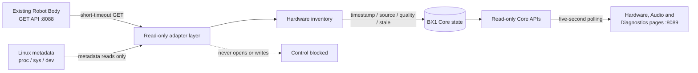

# BX1 OS Read-Only Hardware Integration

## Purpose and safety boundary

BX1 OS Alpha v0.4.0 replaces the Management Interface hardware placeholders
with a read-only inventory. It detects capabilities and proxies telemetry; it
does not control hardware.

The hardware layer:

- reads `/proc`, `/sys`, `/dev` directory metadata and allowlisted Robot Body
  GET endpoints;
- never opens a device node, serial port, camera stream, I2C/SPI bus or audio
  stream;
- never invokes a mixer, GPIO, PWM, RS485, reset or service command;
- uses bounded reads and short HTTP timeouts;
- isolates every adapter failure and treats missing optional hardware as
  informational; and
- records `bx1-web.service` ownership without changing that ownership.

Port 8088 and the existing Robot Body application remain read-only data
sources. BX1 OS stays on port 8089 under `bx1-os-alpha.service`.

## Architecture



Adapters live in `Robot/python/bx1_core/hardware/`. `inventory.py` is the
failure-isolated composition root. The Hardware Core plugin publishes its
result into the central state store; browser code never examines host hardware
directly.

## Device adapter contract

Every discovered or configured device is represented by:

| Field | Meaning |
|---|---|
| `device_id` | Stable adapter-local identifier |
| `name`, `category` | Human-readable name and capability group |
| `present`, `available` | Detection and non-owning availability |
| `ownership` | `unclaimed`, `kernel`, `bx1-web.service` or unknown owner |
| `health` | State, reason, and healthy/warning/fault flags |
| `details` | Sanitised metadata; never process environments or secrets |
| `last_seen`, `error` | Observation time and safe error classification |
| `telemetry` | Read-only values already available from safe sources |
| `capabilities` | Explicitly reports metadata support and blocked control |
| `source` | System metadata or `Existing Robot Body` |

States are `online`, `offline`, `detected`, `busy`, `owned_elsewhere`,
`permission_denied`, `unsupported`, `adapter_pending`, `unavailable`, or
`unknown`.

Core state wraps adapter values in an observation envelope:

```json
{
  "value": {},
  "timestamp": 0,
  "source": "Existing Robot Body",
  "quality": "proxied",
  "stale": false,
  "error": ""
}
```

Published namespaces include `hardware.inventory`, `hardware.audio`,
`hardware.camera`, `hardware.serial`, `hardware.mcu`, `hardware.imu`,
`hardware.servos`, `hardware.motors`, `hardware.touchscreen`,
`hardware.display`, `hardware.network`, `hardware.battery`, and
`robot_body.*`.

## Detection, observation and control

- **Detection** establishes that metadata or configuration identifies a
  device. It does not prove the device is usable.
- **Observation** reads already exposed metadata or telemetry without taking
  ownership. This is the maximum capability in v0.4.0.
- **Control** changes state, opens an active stream, sends a probe, or claims a
  bus. Control is blocked in v0.4.0.

A configured device which is absent is reported, not fabricated. An adapter
without a safe implementation reports `adapter_pending`. Permission and
ownership failures degrade that device, not the entire operating system.

## Adding an adapter

1. Add a module under `bx1_core/hardware/` with a `discover()` method.
2. Accept `HardwareEnvironment` rather than calling host APIs directly.
3. Return `DeviceRecord` values and never open device nodes.
4. Use `ReadOnlyHardwareInventory._safe()` so one adapter cannot stop updates.
5. Publish through `HardwarePlugin`; do not add direct UI host queries.
6. Add deterministic tests for absent, permission-denied, owned and malformed
   data.
7. Document any metadata command before adding it. Commands that change state
   or can claim hardware are prohibited.

## Read-only API

- `GET /api/core/hardware`
- `GET /api/core/hardware/inventory`
- `GET /api/core/robot-body`
- `GET /api/core/robot-body/health`

POST, PUT, PATCH and DELETE remain disabled. The Robot Body adapter only calls
allowlisted loopback GET endpoints on port 8088 and limits response size and
duration.

## Known limitations

- USB identities and camera formats can be unavailable when sysfs metadata is
  incomplete; v0.4.0 does not run an active camera query.
- Serial candidates are not probed, so their role may remain unknown.
- IMU, MCU, servo and motor status depends on telemetry/configuration exposed
  by the existing Robot Body.
- Display rotation/mapping and battery values are reported only when Linux
  exposes non-invasive metadata.
- Ownership discovery is best-effort and may be restricted by `/proc`
  permissions.
